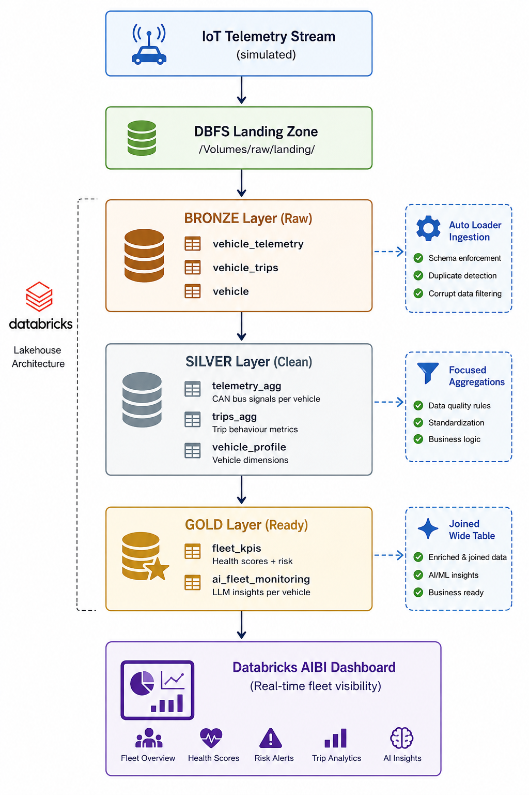

# 🚗 Vehicle Telemetry Platform


 AI-augmented data pipeline for fleet vehicle health monitoring and predictive maintenance recommendations using Databricks Lakehouse, Delta Lake, and Mosaic AI.


## Project Overview
 
This platform ingests simulated IoT vehicle telemetry, 
processes it through a medallion architecture (Bronze → Silver → Gold),
and generates per-vehicle maintenance recommendations using LLM-powered 
operational intelligence via Mosaic AI (Meta LLaMA 3.3 70B).

**In production, this pattern powers:**
- Real-time fleet health monitoring for automotive OEMs and fleet operators.
- Predictive maintenance alerting to reduce downtime and extend vehicle lifespan.
- Cost attribution and ROI analysis for maintenance spend.
- Risk classification and operational safety scoring.

## Architecture


## 🚗 Use Cases in Automotive
 
#### 1. **Predictive Maintenance for Fleet Operators**
Monitor thousands of vehicles in real-time. AI identifies which vehicles need maintenance before failure occurs, reducing costly downtime.
 
**Example insight:**
> "Vehicle VEH-1025 is in CRITICAL risk. Engine coolant temperature is elevated at 100.53°C, combined with high RPM of 5251. Recommend urgent cooling system inspection to prevent engine failure."
 
**Impact:** Reduce unplanned maintenance from 30% to <5% of fleet workload.
 

 
### 2. **OEM Warranty & Recall Management**
Aggregate telemetry across a vehicle model line. Detect systemic failures earlier (e.g., all Mercedes trucks showing brake pad wear > 85%).
 
**Example:** If 10+ vehicles of a specific model show identical DTC codes within a time window, escalate to engineering for potential recall.
 
**Impact:** Identify safety issues before they reach customer complaints.
 

 
### 3. **Fleet Cost Attribution**
Connect maintenance spend to telemetry signals. Build ROI models showing which preventive actions actually reduce overall costs.
 
**Example analysis:**
- Cost: €500/vehicle for quarterly coolant system flush
- Benefit: Reduced engine failures (−€8,000 per failure)
- ROI: 1600% for targeted high-risk fleet segments

 
### 4. **Driver Behaviour & Safety Scoring**
Identify risky driving patterns (sustained high RPM, aggressive braking) correlated with vehicle failure and insurance claims.
 
**Example:** Drivers in the top 10% for aggressive driving show 40% higher brake wear. Implement driver coaching program.
 

 
### 5. **Supply Chain & Parts Planning**
Predict maintenance demand by part type. If 25% of fleet shows brake pad wear >80%, procurement knows to stock 250+ brake pads next month.
 
**Example:** AI predicts battery failures in 40 vehicles over next 30 days → order 45 units, avoid stockouts.
 

 
### 6. **Connected Vehicle & Telematics Integration**
Real-world fleet systems (e.g. ZF Aftermarket, Bosch Connected Services) stream live CAN bus data into this pipeline. Scale from 33 vehicles (demo) to 100,000+ vehicles with the same architecture.
 
**Architectural advantage:** Auto Loader + Delta Lake handles late arrivals, duplicates, and schema changes.
 
## 🔧 Technical Stack
 
| Component | Technology | Purpose |
|---|---|---|
| **Cloud** | Databricks (Free Edition → AWS/Azure) | Compute & orchestration |
| **Data Lake** | Delta Lake on DBFS/ADLS Gen2 | ACID transactions, schema evolution |
| **Ingestion** | Auto Loader (streaming) | Incremental file ingestion with checkpoint |
| **Processing** | PySpark + SQL | ETL transformations |
| **AI/ML** | Mosaic AI (Meta LLaMA 3.3 70B) | Per-vehicle insight generation |
| **Governance** | Unity Catalog | Lineage, tags, ownership, PII masking |
| **BI** | Databricks AIBI + Genie | Interactive dashboards + NLG |
| **Version Control** | Git + GitHub | Code, documentation, reproducibility |


## Key Metrics
 
**Current demo state (33 vehicles):**
- 33 total vehicles monitored
- 15 GOOD, 9 WARNING, 9 CRITICAL
- Average fleet health score: 81.71 / 100
- Risk distribution: 45% GOOD, 27% WARNING, 27% CRITICAL

**Production scale (automotive OEM with 100,000 vehicles):**
- Billions of telemetry readings per day
- Sub-second latency for critical alerts
- AI insights generated per vehicle in <2 seconds
- Dashboard refresh every 5 minutes
- Data retention: 36 months of historical telemetry
---
##  Data Lineage
 
**Full Bronze-to-Gold lineage tracked in Unity Catalog:**
 
```
bronze.vehicle_telemetry  ──────┐
                                 ├──> silver.telemetry_agg ──┐
bronze.vehicle_trips      ──────┤                             ├──> gold.fleet_kpis ──> gold.ai_fleet_monitoring
                                 ├──> silver.trips_agg ────┤
bronze.vehicle            ──────┴──> silver.vehicle_profile ─┘
```


## Tech Stack
- Databricks (Spark Structured Streaming)
- Delta Lake
- Python

## Key Skills Demonstrated
- Lakehouse architecture design
- Streaming + batch ingestion
- Schema evolution handling
- Automotive telemetry modeling
- Production-grade data pipeline design


## 📖 What I Learnt
 
### 1. **Schema Enforcement Catches Bugs Early**
 
Auto Loader's schema enforcement with `rescue` mode was my safety net. When a malformed CAN bus reading arrived (engine_temp = -999), the schema caught it and put it in `_rescued_data` instead of breaking the pipeline.
 

 
### 2. **Spark Broadcast Joins Scale Better Than I Expected**
 
I started pulling vehicle dimension data into Python arrays with `.collect()`. At 33 vehicles it worked fine. At production scale (100k vehicles), that driver node would OOM.
 
The moment I switched to `broadcast(df_vehicle)`, the code was:
- **Smaller** (one line hint vs 5 lines of Python manipulation)
- **Faster** (no serialization, no driver bottleneck)
- **Production-ready** (scales to any dimension size without code change)

 
### 3. **LLM Insights are Commodity Now, but Pipeline Quality Matters**
 
Mosaic AI's `AI_QUERY` with LLaMA generated maintenance recommendations in one SQL line. That was magic.
But the magic only worked because the Gold data was clean. Bad data in → meaningless AI output. The engineering work was 95% data pipelines, 5% AI prompting.
 
**Before learning:** I thought AI was the hard part.  
**After:** I learned the hard part is getting trustworthy data to the AI.

 

 
### 4. **Documentation is Part of the Engineering**
 
The architecture decisions doc took 2 hours to write but becomes the #1 asset in interviews.
 
Without it, I would have told the story verbally: "Yeah, I scrapped Azure because of a compute policy issue..."  
With it, I showed decision-making, trade-off analysis, and production awareness.
 
**Lesson:** Write the doc as you build. 
 

 
### 5. **CAN Bus Signals Live in the Telemetry Stream, Not Separately**
 
I almost created a separate Bronze table for CAN bus data. That would have been architecturally wrong.
 
In real OBD-II systems, CAN signals ARE the telemetry stream. They don't arrive separately. Keeping them in `vehicle_telemetry` meant:
- Correct cardinality (one telemetry row = one CAN frame snapshot)
- Correct temporal alignment (all signals time-stamped together)
- Correct production mapping (mirrors real device output)
**Lesson:** Understand the data source before you model it. The best schema looks like the source data.
 
  

##  Production Considerations
 
For production deployment at scale (100k+ vehicles):
 
- **Dedicated Databricks workspace** with Premium tier + SPICE
- **Lakehouse Monitoring** on Bronze + Silver for data quality alerts
- **Auto-scaling clusters** (2–10 workers) vs serverless compute
- **Scheduled Workflows** (every 5–60 minutes) vs continuous streaming
- **Data retention policy** (raw Bronze: 7 days → Silver: 90 days → Gold: 36 months)
- **Cost optimization:** Z-ordered tables, partition pruning, cached materialized views
- **Secrets management:** Azure Key Vault / AWS Secrets Manager for API keys
- **PII masking:** Mask driver names, phone numbers, vehicle plate number in Silver/Gold layers
- **SLA monitoring:** Alert if insights are stale >5 minutes
---
---
 
## 👋 About
 
**Melody Egwuchukwu** | Cloud Data Engineer | Germany  
Building cloud data systems that solve real problems.  
 
📍 GitHub: [Melody GitHub](https://github.com/ogemelody)  
🔗 LinkedIn: [Melody Egwuchukwu](https://www.linkedin.com/in/melodyegwuchukwu)  
🌐 Web: [melodyegwuchukwu.com](https://melodyegwuchukwu.com)
 
---