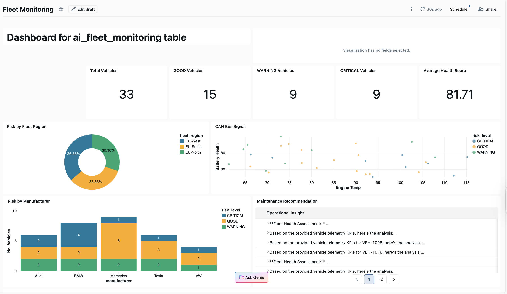

# 🚗 Vehicle Telemetry Platform

## Overview
 AI-augmented data pipeline for fleet vehicle health monitoring and predictive maintenance recommendations using Databricks Lakehouse, Delta Lake, and Mosaic AI.

## Architecture
- Databricks Autoloader ingestion (batch + streaming)
- Medallion architecture (Bronze / Silver / Gold)
- Real-time vehicle telemetry simulation
- Fleet health scoring model

## Features
- Historical trip simulation
- Real-time telemetry streaming (Databricks-native)
- Bronze ingestion pipelines using Auto Loader
- Silver layer feature engineering
- Gold layer fleet KPI scoring

## Tech Stack
- Databricks (Spark Structured Streaming)
- Delta Lake
- Python

## Key Skills Demonstrated
- Lakehouse architecture design
- Streaming + batch ingestion
- Schema evolution handling
- Automotive telemetry modeling
- Production-grade data pipeline design